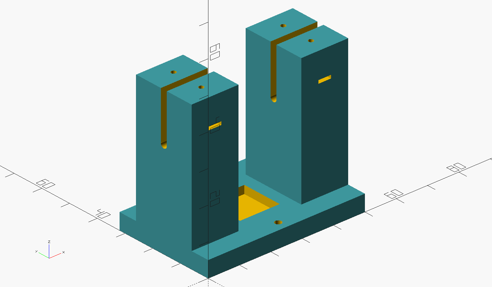
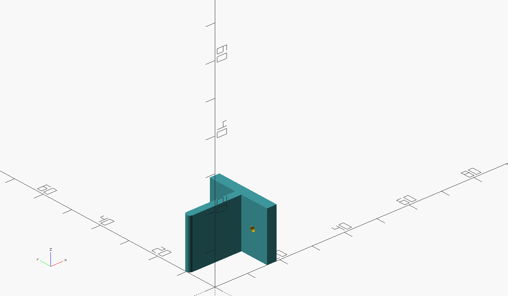

### Cuvette Foundation

  This folder contains OpenSCAD models responsibles for holding the Cuvette in place, so that the optic fiber can guide the radiation coming from the light source right through it. The module was separated in two different modules:

---
1. # CuvetteSupport.scad

    
    
2. # FiberPresses.scad

    
---

## [3D Models for download](https://www.thingiverse.com/thing:6009786)
